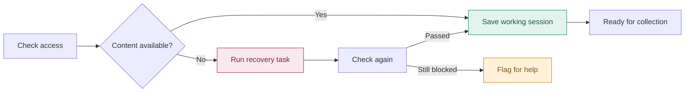
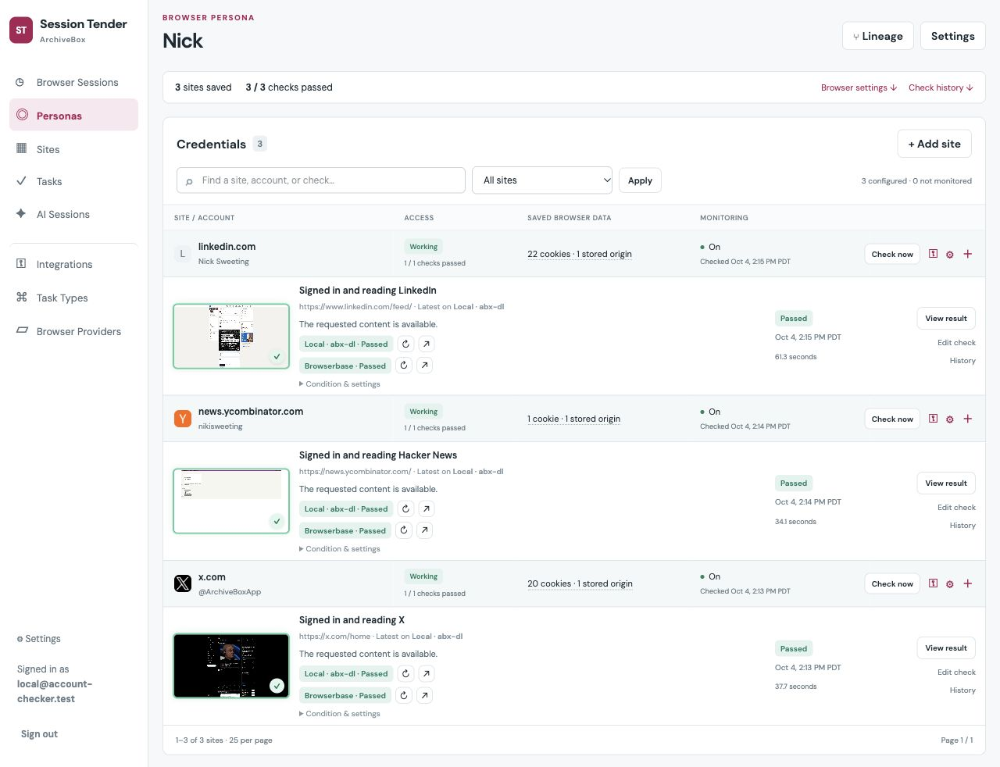
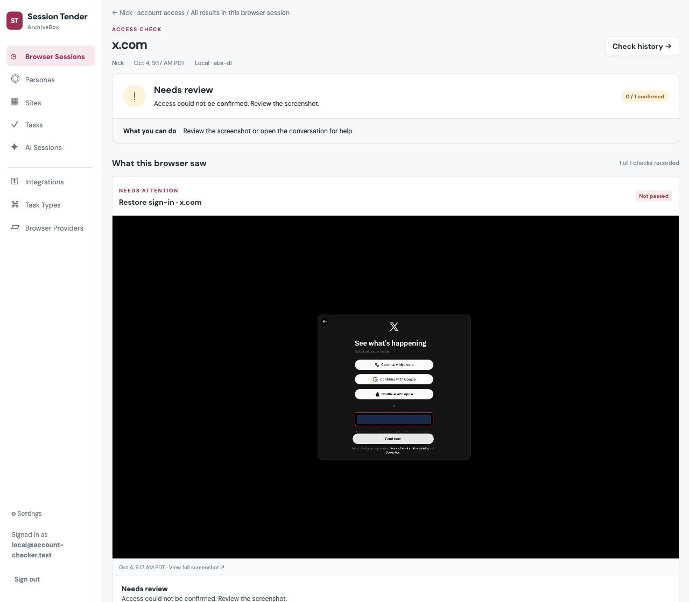
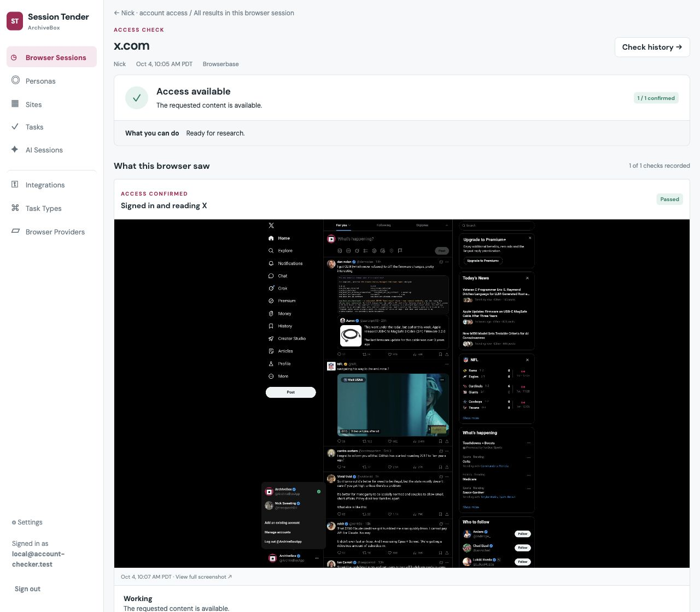
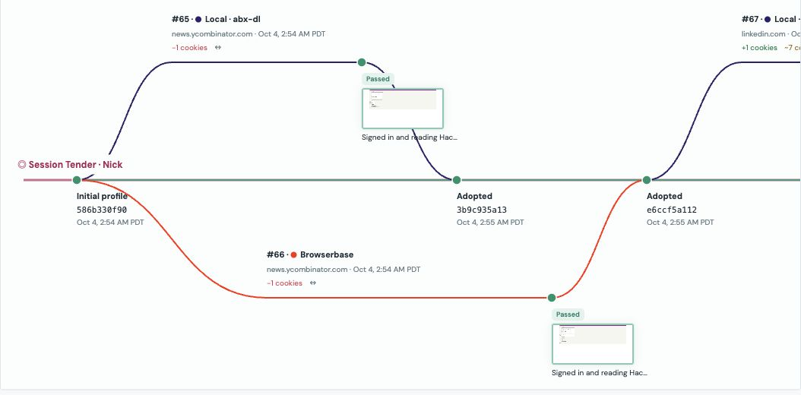

<div align="center">


# Browser Session Autohealer

<sub>ARCHIVEBOX</sub>

### Keep all your browser sessions logged-in and popup-free using AI to write re-usable scripts that fix common problems.

[](#try-it)
[](#from-blocked-to-unblocked)
[](#leader-election-allows-the-same-session-to-be-forked--re-used-by-many-jobs-at-once)
[](#leader-election-allows-the-same-session-to-be-forked--re-used-by-many-jobs-at-once)

[Why it exists](#why-browser-sessions-need-maintenance) · [Screenshots](#ensure-browser-sessions-are-warm-and-ready-for-use-across-any-provider) · [Session history](#leader-election-allows-the-same-session-to-be-forked--re-used-by-many-jobs-at-once) · [Get started](#try-it)

<table>
<tr>
<th width="50%" align="left">🔌 Integrations</th>
<th width="50%" align="left">🌐 Browser providers</th>
</tr>
<tr>
<td valign="top">
<ul>
<li> Autofill credentials from <a href="https://1password.com"><strong>1Password</strong></a></li>
<li> Fill codes &amp; login links sent to <strong>email</strong></li>
<li>  Autofill 2FA from <strong>SMS / iMessage</strong></li>
<li>  Fix novel problems with AI using <a href="https://browser-use.com"><strong>browser-use</strong></a> &amp; <a href="https://www.stagehand.dev"><strong>Stagehand</strong></a></li>
</ul>
</td>
<td valign="top">
<ul>
<li> <a href="https://www.chromium.org">Any Chrome-based browsers</a></li>
<li><a href="https://browserbase.com"> Browserbase</a></li>
<li><a href="https://kernel.sh"> Kernel</a></li>
<li><a href="https://anchorbrowser.io"> Anchor Browser</a></li>
<li><a href="https://browserless.io"> Browserless</a></li>
<li><a href="https://zenrows.com"> ZenRows</a></li>
</ul>
</td>
</tr>
</table>

</div>


## Why browser sessions need maintenance

Scraping at scale often involves dealing with tricky situations including login links sent to an email, captchas, SMS codes, and annoying promotional and cookie consent banners.

You also have to religiously track your browser fingerprint and IP addresses used and keep them in sync with the right cookies to make sure your accounts don't get rate-limited, shadow-banned, or blocked altogether.



This app sits alongside your scraping tool of choice (anything that uses a chrome-based browser, including ArchiveBox, Webrecorder, playwright, and more), and handles monitoring+fixing your browser profiles and sessions so they are warm and ready to use at all times.

It keeps known-good browser fingerprints in sync with their cookies, LocalStorage, IndexedDB, and more. It also handles auto-fixing logged-out sessions by using AI to fill passwords and auth codes from 1Password, SMS, email, and captcha solving providers (via MCP). As the built-in agent (opencode) learns how to check & fix each site over time, it saves re-usable automation scripts (with `browser-use` & `stagehand`) for every fix so the next time, no LLM or token spend is needed when that situation is encountered.

| Common blockers | We handle it all |
| :--- | :--- |
| 🔑 **“Please sign in”** | Expired sessions, new-device challenges, the wrong account selected |
| 📬 **“Check your inbox”** | Email links, SMS codes, authenticator prompts, OTPs |
| 🍪 **“Accept cookies”** | Consent banners covering the content you came for |
| ✨ **“Meet our new feature”** | Product tours, newsletter popups, subscription offers |
| ⏳ **“Try again later”** | Rate limits, CAPTCHAs, access restrictions |


## Ensure browser sessions are warm and ready for use across any provider

- **Screenshot evidence** shows the feed, login wall, or obstruction each browser encountered.
- **Flexible grouping** organizes accounts by persona, site, task, browser session, or AI session.
- **Plain-English checks** describe what you need, such as being signed in to a particular account and able to read its feed.
- **Access history** records failures, recovery attempts, and subsequent results.
- **Separate checks and fixes** let you monitor content without changing it, while allowing recovery tasks to update the session.
- **Integrates with many browser providers:** Browserbase, Kernel, Anchor Browser, Browserless, Zenrows, local Chrome/Brave, and more...




## From blocked to unblocked

<table>
<tr>
<th width="50%">① Access blocked</th>
<th width="50%">② Unblocked</th>
</tr>
<tr>
<td><a href="docs/images/x-blocked.png"></a></td>
<td><a href="docs/images/x-verified.png"></a></td>
</tr>
<tr>
<td><strong>Local · session #80</strong><br>X limited the login attempt, so the agent stopped and the failed session was discarded.</td>
<td><strong>Browserbase · session #82</strong><br>After importing a Brave session, the agent selected @ArchiveBoxApp from the signed-in accounts and ran a separate check to confirm the timeline was readable.</td>
</tr>
</table>

- **Versioned tasks** keep prompts, scripts, revisions, runs, and evidence together for both checks and fixes.
- **Recovery rules** connect recognized failures to an appropriate fix and a follow-up check.
- **Credential placeholders** let scoped integrations supply values to browser tools, with best-effort redaction before model calls.
- **Browser and agent visibility** includes live views, screenshot timelines, and embedded OpenCode conversations.

## Leader election allows the same session to be forked & re-used by many jobs at once

The same known-good session can be "checked out" by many jobs at once, and the last one to finish succesfully becomes the "leader" for future jobs using that account. This ensures that cookie expiration times gets bumped correctly, and that activity looks like a normal human browsing on a few devices at once.



- **Shared persona collection** for ArchiveBox, abx-dl, and other browser automation tools.
- **Isolated browser copies** for parallel sessions on Local Chrome, Browserbase, Generic CDP, Kernel, Anchor Browser, Browserless.io, and ZenRows.
- **A single current leader** updated by eligible successful sessions, with failed sessions excluded.
- **Branch history** showing providers, task results, screenshots, and cookie additions or removals.
- **Checkpoint comparisons** showing what changed, where it came from, and the associated evidence.
- **Selective imports** for the sites you want to use, with browser preferences applied according to provider and CDP support.

## Try it

**Early alpha · self-hosted**

Requires **uv · Docker · Node.js · OpenCode · an OpenAI API key**.

```bash
cp -n .env.example .env
# Set OPENAI_API_KEY in .env before running bootstrap.
uv sync
npm ci
uv run python bin/bootstrap.py
uv run plain server --bind 127.0.0.1:8421 --workers 1
```

Open **[localhost:8421](http://127.0.0.1:8421)**. In another terminal:

```bash
uv run plain accounts worker
```

[Setup, credentials & configuration →](docs/development.md#run-locally)


---

[Development](docs/development.md) · [Architecture](docs/architecture.md) · [Recovery](docs/login-recovery.md) · [Browser providers](docs/providers.md) · [Screenshot sources](docs/images/README.md)

<sub>Screenshots captured from the running app on October 4, 2026. Details are in the <a href="docs/images/README.md">screenshot sources</a>.</sub>
