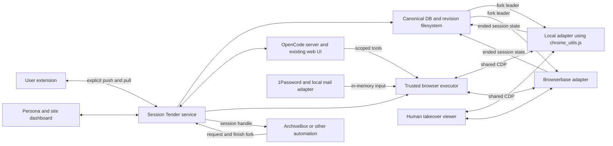

# Architecture proposal

Status: design only. Source inspection completed 2026-10-03; no integration or
classifier performance claims have been runtime-validated in this project.

## 1. Product contract

For each configured persona and site account, answer four independent questions:

1. Can the intended browser run and reach the site?
2. Is it signed in as the expected user account?
3. Does that account have access to the required feed/group/post capability?
4. Is the expected content loaded, visible, and suitable for capture now?

Show when these answers were last established. Never equate a loaded page,
HTTP 200, a cookie, or an agent's success message with usable authenticated access.

Recovery should minimize user effort **and** account damage. Repeated
login attempts can worsen a challenge or lockout. An account suspension, revoked
membership, explicit sign-out, or missing subscription is a distinct outcome,
not a reason to endlessly replay a password. The prototype supports authorized
accounts and normal recovery flows, with bounded attempts and human escalation.

No posting, liking, following, joining groups, purchases, password resets, or
changes to security settings belong in automatic recovery. Consent choices are
configured per site; new terms, sensitive identity checks, and unfamiliar prompts
go to the user. Reading itself can alter history, recommendations, or read
receipts, so label this as content-read-only, not side-effect-free.

## 2. Canonical store and small initial deployment

One Session Tender service owns the canonical list of all known personas,
database, configuration, and versioned filesystem state. ArchiveBox, its browser
extension, and browser providers are checkout consumers and import/export integrations, not competing
persona registries. Provider IDs map to canonical persona/revision IDs. Provider
persistence is a cache/replica; it must not be the only copy of canonical state.

Initial scope: **local Chrome and Browserbase**. Kernel and Browserless have
named deferred placeholders only. Start with one trusted operator/organization,
one coordinator with local storage, and concurrent local/Browserbase sessions.
The initial sites are Facebook, Instagram, X, TikTok, YouTube, Reddit, and LinkedIn.



Use one application service for HTTP, dashboard events, scheduling, and job state;
do not start with Redis, Celery, Temporal, or a fleet manager. Local browser
lifecycle may live in its trusted executor subprocess. Reuse existing process
supervision when deployed alongside ArchiveBox. Separate the agent process from
the executor holding vault credentials, mailbox tokens, and persona artifacts.

TypeScript/Node is the leading implementation choice because the browser helpers
and teleport code are JavaScript/TypeScript. A Python local classifier can be an
optional long-lived subprocess managed with `uv`. Confirm packaging during the
first spike; do not introduce more runtimes merely for hypothetical adapters.

For local sessions, reuse the tested `abx-dl` image digest, Chrome binary, plugins,
fonts, and launch configuration. ArchiveBox already inherits that image.
Browserbase owns its image: record observed differences rather than promising
binary identity across providers. Supported provider identity/stealth settings
are explicit configuration. The standalone product need not depend on Django.

## 3. Check out every use; latest eligible successful check-in leads

The current user decision supersedes unconditional last-ended-wins. Providers
borrow isolated copies from the central collection, record checkpoints and check
events on their branches, and check in final state plus an explicit run report.
Store coherent failed returns for inspection, but do not automatically promote
any run that encountered an issue. See [checkpoint history](checkpoint-history.md)
for the policy, per-site references, graph, shared comparison UI, and Git/LFS spike.

```text
Persona leader A
  run 1 checks out A -> success, no issues, checks pass -> check in B -> leader B
  run 2 checks out A -> success, no issues, checks pass -> check in C -> leader C
  run 3 checks out A -> failure, coherent state exported -> retain D; leader C
  run 4 checks out C -> independent working branch
```

Every checkout pins a base checkpoint and desired-config version and receives an
isolated local profile directory or provider session/context. Never share a
writable native profile. A branch can emit immutable state checkpoints and check
events before completion; intermediate coverage may be incomplete and cannot be
mistaken for a final promotion-eligible snapshot.

Completion protocol:

1. Allocate a run/lease ID with provider, consumer, persona, base checkpoint,
   required-check versions, declared validation scope, and authorization epoch.
2. Restore supported state, apply configuration, and verify required capabilities.
3. Run the task; retain all errors, observations, and checkpoints. Human takeover
   uses the same isolated copy with one authorized controller at a time.
4. Stop accepting actions, export portable state while CDP is live, and quiesce
   the owned browser for coherent native state. Record completion order separately
   from upload arrival, check-in processing, and provider timestamps.
5. Store and validate the return, then evaluate overall success, absence of any
   issue, all required final-state checks, complete durable export, and valid
   authorization/config epochs. Missing or unknown evidence is not success.
6. Atomically advance the appropriate reference only if eligible and later-ended
   than its current eligible leader. A slower upload from an earlier-ended run
   cannot steal leadership. Failed returns stay on their branches.
7. Release owned resources after durable publication or preserved recovery state.
   A dropped connection or expired lease is not a successful check-in.

Use coordinator-assigned end sequence, retaining provider timestamps/event IDs.
Unsynchronized clocks and delayed callbacks cannot establish universal physical
finish order. Reconcile duplicate callbacks and show pending exports explicitly.

Each persona has one current leader, shared across sites and providers. A fully
successful single-site session can advance that pointer without certifying other
sites' access. Any issue excludes the entire run under the default policy.
Declare required checks before checkout; do not narrow scope retroactively to
evade a failed result. Bootstrap imports are unverified bases.

Each reference selects one whole immutable checkpoint. Do not merge concurrent
SQLite/LevelDB databases or silently assemble state from several checkpoints.
Portable exports retain origin coverage, completeness, and deletion tombstones.
Unsupported is not empty. Native profiles require coherent immutable snapshots;
never hardlink mutable databases. Desired configuration changes and operator
revocation use separate epochs so stale observations cannot undo them.

Forks isolate files, not server-side sessions: token rotations can still
invalidate other copies. Preserve lineage and recheck access. Optional per-site
authentication serialization and request budgets mitigate this without removing
ordinary concurrency. Even a successful old-base return can replace another
repair; the shared diff must make that replacement inspectable.

Control claims remain per run/target, with owner, fencing generation, and expiry.
Human-browser import is explicit ingress; discovery cannot drive or stop the
user's everyday browser. ArchiveBox is a consumer of Local/Browserbase
checkouts, distinct from a runtime adapter.

Preserve the existing Chrome markers (`cdp_url.txt`, `target_id.txt`, `browser.json`,
`navigation.json`) and target-specific helpers. `CHROME_CDP_URL` is the attachment
seam; `CHROME_KEEPALIVE` is a lifecycle option, not an ownership protocol.
ArchiveBox's existing per-crawl profile copies are useful, but must check out the
canonical revision and check in final state before deleting runtime `.persona`
directories. Import cookies once per fork/revision, not repeatedly over a repaired
session. Exactly one owner finalizes each fork. Generic browser capabilities stay
in `abx-plugins`/`abx-dl`; Session Tender owns canonical personas and promotion.

The narrow adapter contract is in [providers.md](providers.md). Provider lifecycle,
state transfer, remote files, and viewing differ; browser operations use shared
CDP. Agents get scoped executor tools bound to session/target/origin rather than
raw browser-level CDP credentials or access to every persona. Trusted automation
clients may use CDP within that trust boundary. Keep endpoints authenticated and
unavailable to untrusted networks.

## 4. Browser continuity, storage, and synchronization

Maintain a versioned browser contract with both **desired** and **observed**
values. Include the contract hash, persona revision, provider, and capability
report in every check/capture. Every fork uses it; each new target gets settings
before its first site navigation. Provider identity/stealth settings are explicit
parts of the contract, not hidden defaults that change between runs.

| Surface | Proposed treatment | Important limit |
| --- | --- | --- |
| Cookies | Preserve native profile state; versioned, origin-scoped import with deletion semantics | SameSite, host-only scope, session expiry, and partition keys must survive; Netscape files are lossy |
| localStorage | Native origin storage; explicit import only when needed | Never overwrite fresher runtime state every check |
| sessionStorage | Encrypted checkpoint restored into matching logical tabs/origins in each fork | Not a profile-wide cookie jar; do not fan out transient login/CSRF state to unrelated tabs |
| IndexedDB | Native profile first; qualify any portable export by value type | JSON export cannot represent all structured-clone values or non-exportable keys |
| OPFS, Cache Storage, service workers | Preserve the owning native profile | Generic cookie/storage JSON is not a full browser backup |
| UA and client hints | Keep actual binary, UA, platform, and hints coherent | Copying a macOS UA onto Linux does not copy macOS rendering or hardware |
| Timezone, locale, languages, geolocation | Apply and verify page-visible values and permissions | Geolocation API coordinates do not set network geography |
| Window, screen, viewport, DPR, font/zoom | Pin container fonts and explicit settings; verify new tabs/popups | Outer window, screen and viewport are separate surfaces |
| Color scheme, reduced motion, contrast, accessibility | Version and apply supported values in the shared driver | Record unsupported surfaces rather than silently accepting config |
| Network and OS | Stable host/egress/proxy policy, DNS/WebRTC policy, compatible OS and binary updates | IP/ASN, TLS, GPU, codecs and OS state are not cloned by cookies |

Session-storage restoration must run before site scripts in the matching target,
with explicit expiry and deletion handling. Clear checkpoints after intentional
logout or revocation. Preserve original storage separately from diagnostics.
Never promise that restoring it prevents detection of browser restarts.

Cross-device 1:1 identity is not achievable in general. Device-bound sessions
can require hardware-backed keys from the original device; password-manager
passkeys and user-presence checks also need a compatible authenticator. A site
may require an initial human login in the durable automation browser. For sites
that cannot support portable sessions, a later user-device executor is a
better direction than increasingly elaborate cookie transplantation.

See [Chrome DBSC](https://developer.chrome.com/docs/web-platform/device-bound-session-credentials)
and [Playwright authentication](https://playwright.dev/docs/auth).

Extension/provider sync is versioned ingress/egress into the single canonical
store. Track source device/server/persona IDs, revision, captured time,
origins, completeness, and explicit tombstones. Omitted means unchanged; empty
means clear only the declared scope. Clock timestamps alone cannot resolve
conflicts. Pulls produce imported revisions; pushes name an exact canonical
revision and destination. Do not mutate active forks during background sync.
Live teleport is an explicit separately controlled operation. Recheck after
application/promotion. Do not push login changes into a human browser by default,
or resurrect their intentional sign-out. Reject unsupported cookie
attributes instead of dropping them. Origin includes scheme/host/port; a UI site
may own several origins and identity-provider redirects.

Pushes carry source revision IDs and destination receipts so pulling back our own
unchanged projection is an acknowledgement, not another fresh leader revision.
Deduplicate retries and avoid extension → app → provider → app synchronization
loops. Imported state gets its own provenance and publication ordering.

## 5. Durable data and filesystem layout

Use SQLite on local disk for the prototype, with short transactions and indexed
due-time queries. Never hold a transaction across Chrome, model, mail, filesystem,
or network work. Claims are short compare-and-set writes. Files are written
atomically, then referenced by a committed result; reconcile orphaned artifacts
after a crash. Use UTC internally and display the user's timezone.

Minimum logical records:

| Record | Key information |
| --- | --- |
| Persona | Stable ID, name, canonical filesystem root, leader revision, desired browser contract |
| PersonaRevision | Immutable manifest, base revision, coverage, native/portable artifacts, hashes, end sequence, health |
| ProviderBinding | Persona ID, provider/project/host, context IDs, last pushed/pulled revision, capabilities |
| RuntimeSession | Persona/base revision, isolated fork ID, targets, config revision, end sequence, export status |
| SiteAccount | Persona ID, site/domain, expected identity, allowed origins/IdP origins, secret/mailbox references, recovery policy |
| CheckSpec | Version, plain-English intent, test URLs, identity/content assertions, schedule, script hash |
| CheckRun | Due/start/finish, trigger, observations, independent verdicts, browser generation, artifacts, error |
| Incident | Account/check scope, blocker set, state, recovery attempts, harness session ID, human handoff |
| OperationClaim | Runtime/target or auth-attempt scope, owner, generation, fencing token, expiry |
| Checkpoint | Content ID, parent IDs, persona/run, manifest, coherent coverage, source provenance; sensitive payload outside DB |
| CheckIn | Run outcome, all issues, completion sequence, required-check results, durable export receipt, eligibility decision |
| LeaderRef | Persona-wide or site/account scope, selected checkpoint, qualifying check-in and completion sequence |

Do not store passwords, TOTP seeds, raw OTPs, cookie bodies, or mail bodies in
these tables. Artifact and profile storage is sensitive even if the DB only
contains references. Host disk encryption, restricted service identities, backup
access control, and deliberate retention apply to all three.

Proposed standalone paths follow XDG: configuration under
`$XDG_CONFIG_HOME/account-checker`, DB/incidents under
`$XDG_STATE_HOME/account-checker`, disposable model caches under
`$XDG_CACHE_HOME/account-checker`. Container deployments use an explicitly
mounted state root. The app owns a durable persona filesystem, for example
`personas/<uuid>/revisions/<revision-id>/manifest.json`, native-profile artifacts,
and encrypted portable-state artifacts. Mutable forks live under
`sessions/<session-id>/`. Large binary state is in files referenced from the DB.
A provider-only context ID is not a canonical backup. Provider bindings and
ArchiveBox directories are projections of this single authority.

Discovery precedence: explicit Session Tender config → explicit ArchiveBox
collection/API → explicitly supplied `PERSONAS_DIR` → conventional candidate
collections (`$PWD/data`, `~/archivebox/data`, `/data`) → shared
`~/.config/abx/personas`. Validate candidates before use; enumerate configured
roots only. No recursive home-directory scan or automatic opening of a person's
default browser. Discovery is read-only; enrollment imports metadata and coherent
initial state into the app-owned store. Source ownership, ongoing push/pull, and
scheduled access are explicit settings. Multiple collections and renamed personas must
not merge by display name. Prefer ArchiveBox's API/export for DB-owned metadata;
never write its SQLite DB directly.

## 6. Access checks and classification

The plain-English authoring flow produces a versioned check specification and
a reviewable deterministic script. Example intent: “Open this group, confirm
the user account, and check that at least one post is readable.” The
authoring agent proposes identity indicators, content selectors/text, and
negative cases, runs the check visibly, and records what constitutes success.
Periodic runs execute that artifact; they do not reinterpret the prompt each time.

Use multiple canaries where appropriate: a stable protected post plus a feed or
search capability. A deleted canary is not necessarily an expired login. Check
visible content, not hidden DOM text or a cached page shell. Exact strings can
be strong evidence on a fixed post but brittle on feeds or localized UIs. Record
whether the result came from fresh network activity, cache, or an unknown source.

Observation pipeline:

1. Inspect navigation outcome, final origin, visible identity, known content,
   status/error signals, and browser health.
2. Evaluate deterministic site assertions and known blocker selectors.
3. Classify a bounded local text/DOM/accessibility observation when ambiguous.
4. Optionally use locally processed OCR or approved vision inference for visual
   obstruction; do not ship full research feeds to a cloud model by default.
5. Produce structured observations with evidence references and uncertainty.

Use independent fields rather than a single exclusive label:

- `identity`: expected / wrong / anonymous / unknown.
- `access`: available / partial / denied / unknown.
- `content`: loaded / missing / obstructed / unknown.
- `blockers[]`: login, captcha, email_code, email_link, sms_code, sms_link, totp,
  passkey_or_push, cookie_consent, promotion, tutorial, rate_limit, account_locked,
  membership_or_entitlement, network_failure, site_outage, layout_changed, other.
- Supporting error text, observation IDs, model/recipe version, and confidence
  when meaningful. Unknown is a valid result.

The classifier describes a situation; a policy engine decides permitted actions.
Model scores require calibration on real held-out examples. Optimize especially
against false healthy results and wrong-account recovery, not just average
classification accuracy. Test multilingual and simultaneous blockers. A login
form mentioned inside a post must not trigger a login attempt.

Candidate local baseline: rules first, then GLiClass Instruct Edge on short
observations. Its published weights meet the download target; CPU latency,
language coverage, and account-checking accuracy remain open gates. A trained
small encoder/SetFit-style classifier may outperform zero-shot labels once
users have labeled enough real incidents. Keep the result schema compatible
with a future Clef/other classifier without building a provider framework now.

## 7. Scheduler and recovery state

Checks run on isolated forks at three points: before a requested capture when
health is stale, after relevant sync/leader changes, and periodically. Health is
keyed by persona revision, runtime/provider, account, and capability; a successful
local check does not make Browserbase green. Consume observed failures
from normal captures so frequent polling does not become extra suspicious load.
One good login check does not prove access to every site capability.

A check's own completion/promotion must not recursively schedule another identical
check. Carry its verification with the published revision, deduplicate events,
and invalidate only affected capabilities when a materially different revision
arrives. Default periodic cadence and refresh budgets remain site-specific.

Schedules have per-site request budgets, jitter to spread load, active hours,
and a bounded global concurrency limit. Coalesce duplicate checks; prioritize
an imminent research session. Rate limits honor `Retry-After` or an explicit
cooldown policy. Track site, account, and shared-egress pressure. Avoid automatic
proxy/identity rotation or repeated login/captcha attempts as a generic remedy.

Incidents move through observed → diagnosing → recovering → verifying → resolved,
with waiting_for_human, cooling_down, and unresolved outcomes. Scheduler states
are separate from browser diagnosis. A failed/stale check is visible immediately;
do not retain a green badge while an agent works.

Initial recovery ladder:

1. Run a versioned, approved site recipe for known consent/promo cases.
2. If policy allows, use a known login flow and local credential/code tools.
3. Allow a bounded agent session to diagnose unfamiliar UI and propose/perform
   only permitted actions in that operation's browser target.
4. Hand the same browser to a human for captcha, passkey/push, lockout, unexpected
   terms, identity verification, or uncertainty; pause all other consumers.
5. Re-run the original identity and content assertions before resolving.

Default proposal: at most one credential submission and one matched OTP
submission per attempt, with no automatic resend after an ambiguous result.
Site-specific policy can adjust this after real validation. Persist the pending
step so a crash does not blindly replay a one-time action. Bound agent steps,
elapsed time, spend, and side effects independently of provider defaults.

Learned recipes are proposed changes with provenance, selectors/preconditions,
allowed actions, postconditions, and recorded test outcomes. Promote them after
review and successful rechecks; a single agent success must not silently become
a trusted global skill. Store reusable methods, never captured account secrets or
research content, in the site skill collection.

## 8. Agent UI and browser tools

Use OpenCode's web UI and HTTP/SSE APIs for the first prototype. Give it a
dedicated origin/root, its own state directory, and explicit authentication.
Use provider/settings screens supplied by the product. Store the OpenCode session
ID on an incident and deep-link to it from the dashboard. Programmatic sessions
must appear in that same UI, survive restarts, and support cancellation/handoff.

Reuse the current plugin's binary resolution and lifecycle knowledge, but not
its fixed ArchiveBox URL prefix, singleton process globals, or ArchiveBox-specific
prompt as a generic multi-persona runtime. Inspect the pinned server's `/doc` API
before implementing integration. OpenChamber is the preferred next UI candidate;
its current OpenCode 2.x requirement differs from the inspected 1.18.31 pin.

For browser actions, start with Puppeteer through `chrome_utils.js`. Add Stagehand
`observe`/`act` for natural-language authoring and recovery on a specifically
bound page if the spike proves compatibility. Playwright is useful for acceptance
tests and optional deterministic scripts attached over CDP. Browser-use and
agent-browser are alternatives to qualify, not simultaneous required runtimes.
Never let any library launch its own default browser, choose `pages()[0]`, change
canonical settings, or close a runtime owned by another component implicitly.

CDP screencast can show a controlled tab and support scoped input. Browserbase's
live viewer should be exposed through the provider adapter instead of rebuilt. It does not
replace a full desktop for browser chrome, OS dialogs, or authenticators. A
headed browser with an existing noVNC viewer is the likely human-recovery option
for Linux. Verify native dialogs and passkey behavior rather than assuming VNC
can forward a user's local authenticator. View/control sessions need short
lived authorization and an exclusive handoff. Recording is opt-in; mask or stop
capture during secret entry, including OTP fields rendered as ordinary text.

## 9. Secrets, OTP, email, and SMS

The agent receives opaque references and action results, not secret values.
A proposed tool such as `fill_credential(account_id, field, operation_id)` resolves
the configured vault item in the executor, revalidates top/frame origin and target,
and fills locally. The caller cannot supply an arbitrary vault path, recipient,
navigation destination, or JavaScript expression. The tool's response says filled
or failed; it does not echo the value. Do the same for one-time codes.

Use the official 1Password SDK/CLI from that trusted executor. Desktop approval
is appropriate on a user's computer; a dedicated read-only service-account
vault is appropriate for a server when the organization permits it. Store `op://`
references in config. Resolve TOTP just in time, keep clocks correct, and never
copy a TOTP seed into a recipe. Hardware/passkey and push factors get separate
human/device flows. The official Environments MCP is useful for setup but is not
a generic vault-password/OTP retrieval endpoint.

Stagehand variables and browser-use `sensitive_data` help keep values out of model
prompts, but are not an isolation boundary. Browser processes must see the input
in memory, and screenshots, traces, DOM snapshots, crash dumps, shell access,
or provider logs can still expose it. Disable generic shell/filesystem access
to profiles, mail, and the secret broker from recovery sessions. Separate the
agent's runtime identity/mounts from the executor. Do not promise “never plaintext”
in process memory; the goal is no plaintext persistence or model disclosure.

Prefer Gmail's read-only API or an IMAP adapter using read-only mailbox selection,
UID searches, and `BODY.PEEK`, plus IDLE/reconciliation where supported. Gmail
push uses Pub/Sub with renewed watches and history reconciliation; notifications
are hints, not the only source of truth. Poll a small recent window during an
active challenge before building always-on inbox ingestion. Gmail read-only
authorization still grants broad mailbox reading; a label/query is not an OAuth
security boundary. Use a dedicated research mailbox when possible.

Local challenge matching:

1. Create a challenge bound to site, account, recipient, operation, request time,
   expected message type, and deadline. Serialize overlapping challenges.
2. Fetch bounded metadata/candidates from the expected mailbox and recent time
   range. Parse MIME locally without loading remote HTML resources/attachments.
3. Validate recipient, sender/domain, available trusted mail authentication
   results, and site-specific structure. None alone establishes provenance.
4. Use deterministic extraction, with local classification only for ambiguous
   candidate selection. Validate code shape/expiry or link origin/redirects.
5. Return an opaque expiring code/link handle to the executor, reserve it for
   that attempt, and consume it once. Do not return an entire message to the LLM.

MCP is the tool transport, not the reason to grant a general email agent access.
Existing Gmail/IMAP MCP servers can sit behind the local matcher after their
scopes and token storage are qualified. Expose only wait-for-challenge / consume
operations to recovery agents. No send/delete/draft tools are needed.

SMS can later use an organization-controlled SMS inbox/modem/provider or a human
entry flow. A public rented-number/captcha service is not a prototype dependency.
Apply the same recipient, freshness, expiry, and single-use binding.

## 10. Dashboard, integration, and evidence

Persona rows show name, canonical path, leader revision, pending promotion,
active forks, source locations/providers, browser contract drift, and sync status.
Nested site rows show domain, expected
username/email, last successful identity/content checks, last attempt, next check,
current blocker(s), and recovery/human status. Additional checks sit under a site.
Show per-provider results, fork ancestry, and explicit push/pull/test controls.
A compare run uses the same pinned persona revision, recipe, and content on local
and Browserbase forks, recording actual fingerprint and storage differences.

Use plain status text: Accessible, Content partly blocked, Signed out, Wrong
account, Waiting for code, Needs your help, Rate limited until…, Check failed,
Not checked, and Stale. Health includes freshness and capability scope.

Actions: Check now, Open browser, Take over, Resume checks, Pause, Edit check,
Edit recovery policy, and Open agent session. Human work resumes with a recheck.
Edit the same DB-backed configuration through UI/API; avoid two competing editable
sources. Configuration files provide defaults/import/export with explicit revisions.

Provide a small documented HTTP/CLI surface for discovery, health, requesting a
check, creating/finalizing forks, pushing/pulling state, and incident events. MCP exposes permitted
tools for agents; non-agent consumers should not need an LLM or MCP runtime.
Use SSE/webhooks for consumers that want state changes. Names and response shapes
remain proposals until the first integration proves what is required.

Capture clients must validate account health at use time; a prior green dashboard
can go stale. For the strongest continuity, capture the exact verified target
before finalizing that fork. If ArchiveBox opens a new tab or forks again, verify
access there against that runtime's actual state. Non-browser downloaders need their own credential and content checks;
authenticated Chrome does not automatically authenticate wget/curl/yt-dlp.

Keep raw collection evidence separate from operational screenshots and agent
interpretations. Record source URL, UTC observation time, account/persona ID,
profile/config generation, browser/recipe/model versions, interventions, capture
IDs, and hashes of retained artifacts. Preserve before/after references when a
popup is dismissed. A DOM modified to hide an overlay must not be represented as
an untouched original page. Do not use the model's account diagnosis as proof of
the truth of captured content. Evidence retention may differ from short-lived
diagnostics; legal holds must survive routine diagnostic cleanup.

Research pages and incoming mail are untrusted input. Their text cannot authorize
tool calls, expand allowed origins, reveal secrets, or modify skills. Team use
requires user/persona authorization on dashboard, artifacts, sessions, and
browser streams; neither an OpenCode password nor ArchiveBox superuser access
provides that isolation by itself. The single-operator prototype must be labeled
as such until these boundaries are implemented and tested.
